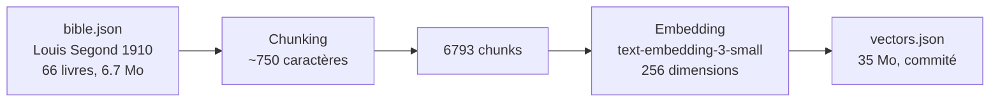

# God en Live — Assistant Bible RAG

Démo portfolio d'un système RAG (Retrieval-Augmented Generation) qui vectorise la Bible Louis Segond 1910 et répond aux questions en langage naturel, avec citations des versets sources et mémoire de la conversation.

🔗 **Démo :** [chatwithgod-pi.vercel.app](https://chatwithgod-pi.vercel.app/)
📦 **Repo :** [github.com/lewenbach228/MAS--Agent-RAG---God-en-Live](https://github.com/lewenbach228/MAS--Agent-RAG---God-en-Live)
📂 **Portfolio :** [architect-agent-portfolio.vercel.app](https://architect-agent-portfolio.vercel.app/)

## Pourquoi ce projet existe

Je voulais comprendre et prouver un pipeline RAG complet, de bout en bout, sans wrapper, sans SDK magique, sans backend serveur.

La plupart des démos RAG montrent un résultat final en disant "regardez, ça répond". Moi je voulais montrer :

- comment le texte est chargé et découpé (chunking)
- comment les vecteurs sont produits (embeddings)
- comment la recherche sémantique fonctionne (similarité cosinus)
- comment le LLM utilise le contexte trouvé pour répondre (retrieval + generation)
- comment on évite le cold start au déploiement (vecteurs pré-calculés)
- et comment on garde la conversation fluide (mémoire des échanges)

L'objectif n'est pas de produire un "chat avec Jésus" — c'est de prouver qu'on sait concevoir, architecturer et livrer un système RAG fonctionnel, testé, documenté et déployable.

## Ce que montre la démo

### Mode demo (sans clé API)

3 questions seedées avec réponses et citations pré-écrites :

1. *Que dit la Bible sur l'amour ?* → 1 Corinthiens 13:4-7, Jean 3:16, 1 Jean 4:8
2. *Pourquoi y a-t-il autant de souffrance dans le monde ?* → Jean 16:33, Romains 8:18, Apocalypse 21:4
3. *Qui était Moïse ?* → Exode 3, Exode 20, Deutéronome 34:10

### Mode connecté (BYOK — Bring Your Own Key)

L'utilisateur entre sa propre clé API OpenAI et pose **n'importe quelle question**. Le système :

1. vectorise la question via `text-embedding-3-small`
2. cherche les 5 passages les plus proches dans le vector store local (6793 chunks)
3. construit un contexte avec les passages trouvés
4. envoie le tout à `GPT-4o-mini` avec l'historique de la conversation
5. affiche la réponse + les citations extraites des passages sources

Le système gère naturellement les salutations, le hors-sujet, et maintient une mémoire des 10 derniers tours de discussion.

## Positionnement produit

Ce projet **est** :

- un système RAG complet, fonctionnel et testé
- une architecture front-end uniquement (React + Vite), sans backend serveur
- une démonstration de clean architecture (domain / services / features)
- un exemple de vecteurs pré-calculés pour éviter le cold start
- un système honnête : ce qui est réel, ce qui est seedé, ce qui est provider est explicitement dit

Ce projet **n'est pas** :

- un chatbot "Jésus AI" ou un oracle spirituel
- un modèle entraîné sur la Bible
- un système distribué avec Pinecone, LangChain ou backend
- une application de production avec authentification, base de données ou scaling
- une interface en temps réel (streaming actif dans cette V2)

## Vue d'ensemble de l'architecture

### Pipeline d'indexation (pré-calculé à la build)



Exécuté une fois via `npm run index` — les vecteurs sont commités dans le repo pour un démarrage instantané au runtime.

### Pipeline de question (runtime)


### Flux détaillé

1. L'utilisateur saisit une question dans l'interface
2. Le service `OpenAIEmbeddings` vectorise la question (256 dimensions)
3. Le `LocalVectorStore` calcule la similarité cosinus entre la question et les 6793 chunks
4. Les 5 chunks les plus proches sont récupérés avec leurs références bibliques
5. Le contexte (passages + références) + la question + l'historique sont envoyés au LLM
6. `GPT-4o-mini` génère une réponse chaleureuse, aérée, qui se termine par une question ouverte
7. Les citations sont extraites **des chunks retrouvés** (pas du texte LLM) pour fiabilité

### Gestion des salutations et hors-sujet

Quand aucun passage pertinent n'est trouvé (salutation, question personnelle, hors-sujet), le LLM répond avec bienveillance comme un guide spirituel : il rend la pareille aux salutations, redirige doucement vers les Écritures, et ne dit jamais "je n'ai pas trouvé de passages pertinents".

## Fonctionnalités

- **Pipeline RAG complet** : embedding → vector search → LLM generation
- **Vecteurs pré-calculés** : démarrage instantané, pas d'attente à l'initialisation
- **Mémoire conversationnelle** : les 10 derniers tours sont passés au LLM
- **Streaming des réponses** : les mots arrivent un par un comme dans ChatGPT
- **Citations cliquables** : cliquez sur un verset pour voir le texte complet
- **Citations fiables** : issues des chunks retrouvés, pas du texte généré
- **Mode demo** : 3 questions seedées, sans clé API, pour tester l'interface
- **Mode connecté** : BYOK, n'importe quelle question, pipeline réel
- **Fallback automatique** : si `vectors.json` est absent, vectorisation à chaud par lots de 50
- **Design sobre** : thème sombre chaud, verre dépoli, typographie Archivo + Inter
- **Architecture propre** : domain / services / features / UI séparés et testables

## Stack technique

| Couche | Technologie |
|--------|-------------|
| Frontend | React 18, TypeScript, Vite |
| Tests | Vitest, Testing Library (jsdom) |
| Embeddings | OpenAI text-embedding-3-small (API) |
| Vector store | Local (similarité cosinus, custom) |
| LLM | OpenAI GPT-4o-mini (API) |
| Indexation | Script Node.js via vite-node |
| Police | Archivo (titres) + Inter (corps) — Google Fonts |
| Déploiement | Vercel (statique) |

Aucune dépendance SDK OpenAI côté client — les appels API sont faits en `fetch()` natif.

## Structure du projet

```
src/
├── domain/
│   ├── bible/                # Modèles, chargement, chunking (bible.json)
│   │   ├── types.ts          # Book, Chapter, Verse, Chunk
│   │   ├── bibleLoader.ts    # Chargement + chunking (~750 car.)
│   │   └── indexedBibleLoader.ts  # Chargement vecteurs pré-calculés
│   └── rag/
│       └── ragPipeline.ts    # Orchestration RAG (ask + initialize)
├── services/
│   ├── embeddings/           # OpenAI embeddings + mock
│   ├── vector-store/         # Vector store local (similarité cosinus)
│   └── llm/                  # OpenAI GPT-4o-mini + mock
├── features/
│   └── chat/                 # Interface de chat (ChatPage, composants)
├── components/               # UI réutilisable
├── hooks/                    # Hooks React
├── lib/                      # Utilitaires
├── styles/
│   └── global.css            # Design system sombre/or
scripts/
└── indexBible.ts             # Script d'indexation → public/vectors.json
public/
├── vectors.json              # 6793 chunks × 256 dimensions (35 Mo)
└── god-icon.jpg              # Bannière : La Création d'Adam (Michel-Ange)
tests/
├── domain/
│   ├── bible/bibleLoader.test.ts
│   └── rag/ragPipeline.test.ts
├── services/vector-store/localVectorStore.test.ts
├── App.test.tsx
└── getStarterChecklist.test.ts
```

## Lancement local

```bash
# 1. Installer les dépendances
npm install

# 2. Lancer en développement
npm run dev

# 3. Lancer les tests
npm test

# 4. Build production
npm run build
```

### Indexation de la Bible (optionnel)

Les vecteurs sont déjà pré-calculés dans `public/vectors.json`. Pour les re-générer :

```bash
npm run index
```

Nécessite une clé API OpenAI valide dans `.env`.

## Variables d'environnement

```env
VITE_OPENAI_API_KEY=          # Clé API OpenAI (optionnelle en mode demo)
VITE_APP_MODE=demo            # Mode par défaut
```

Voir [.env.example](./.env.example).

## Notes de sécurité

- Aucune clé API n'est requise pour la démo par défaut
- Le projet suit un modèle **BYOK** : la clé est saisie dans l'interface et stockée dans `localStorage`
- Les secrets ne sont jamais commités dans le dépôt
- Aucune action externe réelle n'est déclenchée
- Le code OpenAI SDK n'est pas utilisé — les appels sont en `fetch()` natif (pas de dépendance cachée)
- Le prompt system inclut des **gardes anti-injection** : le LLM ne peut pas être détourné de son rôle de guide spirituel
- La taille des questions est **limitée à 5000 caractères** côté UI
- En mode connecté (BYOK), la clé API est visible dans les requêtes réseau — c'est le modèle assumé : chaque utilisateur utilise sa propre clé

## Périmètre actuel

- Assistant RAG fonctionnel avec la Bible Louis Segond 1910 (66 livres)
- 6793 chunks vectorisés, ~750 caractères chacun
- Mode demo (3 questions seedées) + mode connecté (BYOK)
- Mémoire conversationnelle (10 derniers tours)
- Citations extraites des passages sources
- Gestion des salutations et hors-sujet par le LLM
- Interface de chat complète (thème sombre, typographie Archivo/Inter)
- Streaming des réponses token par token
- Citations cliquables affichant le texte du verset
- 25 tests unitaires, build stable

## Limites actuelles

- Pas de base de données persistante (mémoire navigateur uniquement)
- Pas d'authentification ou de comptes utilisateurs
- Vector store local et linéaire (pas de Pinecone / HNSW)
- La Bible est en Français Louis Segond 1910 uniquement (une version, pas de multi-traduction)

## Angle portfolio

Un système RAG complet, front-end uniquement, qui vectorise la Bible et répond aux questions en langage naturel avec citations sources. Architecture clean, vecteurs pré-calculés, mémoire conversationnelle et BYOK. Construit en mode mentor pour prouver une compétence de bout en bout sur les pipelines RAG.

---

*Projet portfolio construit pour prouver une compétence RAG de bout en bout. Code libre et documenté.*
