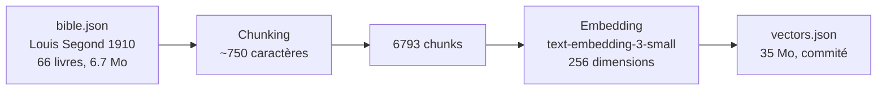

# God en Live — Pipeline RAG complet, front-end pur

Un **pipeline RAG** (Retrieval-Augmented Generation) qui vectorise la Bible Louis Segond 1910 (66 livres, 6793 chunks) et répond à des questions en langage naturel avec **citations des versets sources vérifiables**. Mode demo sans clé API, mode connecté BYOK (votre clé OpenAI). Streaming SSE, mémoire conversationnelle, citations cliquables.

**Live demo :** [chatwithgod-pi.vercel.app](https://chatwithgod-pi.vercel.app/)

---

## Architecture

### Pipeline d'indexation (pré-calculé à la build)



Exécuté une fois via `npm run index` — les vecteurs sont commités dans le repo pour un démarrage instantané au runtime.

### Pipeline de question (runtime)


---

## How It Works

### 1. Entrée — Une question, deux modes

```bash
# Mode demo (3 seed questions, zéro API key)
→ Cliquer sur "Que dit la Bible sur l'amour ?"

# Mode connecté (BYOK — votre clé OpenAI)
→ Entrer sa clé API → poser n'importe quelle question
```

### 2. La question devient un vecteur

Le service `OpenAIEmbeddings` vectorise la question via **text-embedding-3-small** (256 dimensions) — un simple `fetch()` natif, pas de SDK OpenAI.

### 3. Recherche sémantique dans 6793 chunks

Le `LocalVectorStore` calcule la **similarité cosinus** entre le vecteur question et les 6793 chunks pré-calculés. Les 5 chunks les plus pertinents (threshold ≥ 0.5) sont récupérés avec leurs références bibliques.

### 4. Contexte + Mémoire → LLM

Le système construit un prompt avec :
- Les passages retrouvés (format : `--- Livre Chapitre:Versets ---\ntexte`)
- L'historique des 10 derniers tours de conversation
- La question actuelle

### 5. Génération avec GPT-4o-mini, pas d'hallucination

Le LLM génère une réponse chaleureuse et aérée. **Les citations sont extraites des chunks retrouvés** (pas du texte LLM) — chaque verset est vérifiable.

### 6. Streaming et citations cliquables

```
event: token → mot par mot (SSE streaming)
event: complete → réponse + citations
click: "Jean 3:16" → texte complet du verset
```

---

## Stack

| Couche | Technologie | Usage |
|--------|-------------|-------|
| **Frontend** | React 18, TypeScript, Vite | Application statique |
| **Embeddings** | OpenAI text-embedding-3-small (256d) | Vectorisation des 6793 chunks |
| **Vector store** | In-memory (similarité cosinus, custom) | Recherche sémantique |
| **LLM** | OpenAI GPT-4o-mini | Génération de réponses + streaming |
| **Tests** | Vitest, Testing Library (jsdom) | 26 tests unitaires |
| **Déploiement** | Vercel (statique) | Auto-deploy depuis GitHub |

Aucune dépendance SDK OpenAI côté client — les appels API sont faits en `fetch()` natif.

---

## Quick Start

```bash
# 1. Installer les dépendances
npm install

# 2. Lancer en développement
npm run dev
# → http://localhost:5173

# 3. Lancer les tests
npm test

# 4. Build production
npm run build

# 5. Ré-indexer la Bible (optionnel — vecteurs déjà pré-calculés)
npm run index
```

### Variables d'environnement

```env
VITE_OPENAI_API_KEY=          # Clé API OpenAI (optionnelle en mode demo)
VITE_APP_MODE=demo            # Mode par défaut
```

---

## Ce que ça prouve

### Compétences agentiques

| Compétence | Comment |
|------------|---------|
| **Pipeline RAG complet** | Chunking → Embeddings → Vector search → LLM generation, de bout en bout |
| **Embeddings via API** | OpenAI text-embedding-3-small (256d) avec fetch() natif, zéro SDK |
| **Vector search in-memory** | Similarité cosinus, threshold ≥ 0.5, classement par score |
| **Citations fiables** | Extraites des chunks retrouvés, pas du texte LLM — cliquables et vérifiables |
| **Cold start zéro** | 6793 embeddings pré-calculés commités (35MB) — démarrage instantané |
| **SSE streaming** | Réponses token par token via Server-Sent Events, parse des data: natives |
| **BYOK model** | L'utilisateur apporte sa propre clé API OpenAI, stockée en localStorage |
| **Architecture front-end pure** | React + Vite, zéro backend, zéro base de données |
| **Conversation memory** | 10 derniers tours injectés dans chaque appel LLM |

### Stacks maîtrisées

- React 18, TypeScript, Vite
- OpenAI API (embeddings + LLM), fetch() natif
- Vector store custom (similarité cosinus en pur TypeScript)
- Vitest, Testing Library
- Vercel (déploiement statique)
- SSE streaming, clean architecture (domain/services/features)

### Patterns d'architecture

| Pattern | Où |
|---------|-----|
| **RAG Pipeline** | `RAGEngine` classe : initialize → embed → search → context → generate |
| **Chunking** | BibleLoader : ~750 caractères par chunk, avec tracking des références |
| **Vector Search** | LocalVectorStore : cosine similarity O(n), search + threshold |
| **BYOK / Demo modes** | AppMode (demo/connected), 3 seed questions hardcodées + pipeline live |
| **SSE Streaming** | OpenAI stream: true, parse des data: events, token callbacks |
| **Mémoire conversationnelle** | ConversationTurn[], last 10 turns injectés comme historique |
| **Citation lookup** | verseLookup : parsing "Livre Chapitre:Verset" → texte complet depuis cache |

---

## Tests

```bash
npm test              # 24 tests (vitest)
```

| Fichier | Tests | Couvre |
|---------|-------|--------|
| `tests/domain/bible/bibleLoader.test.ts` | 11 | 66 books, chunking, verse lookup |
| `tests/domain/rag/ragPipeline.test.ts` | 5 | Demo questions, rejection, answer format, citations |
| `tests/services/vector-store/localVectorStore.test.ts` | 7 | Add, search, cosine similarity, clear |
| `tests/App.test.tsx` | 1 | Renders heading, input, demo button |

---

## Notes de sécurité

- Aucune clé API requise pour la démo par défaut
- Modèle **BYOK** : la clé est saisie dans l'interface et stockée dans `localStorage`
- Les secrets ne sont jamais commités dans le dépôt
- Appels API en `fetch()` natif — pas de dépendance SDK cachée
- Prompt system avec **garde anti-injection** : le LLM ne peut pas être détourné de son rôle
- Limite de 5000 caractères sur les questions côté UI
